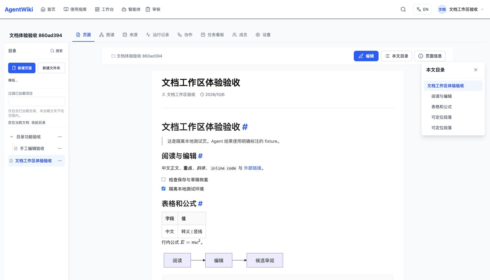
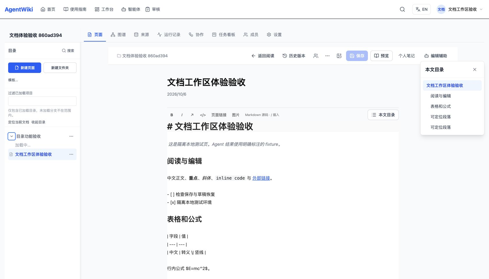

# 文档工作区优化验收

日期：2026-10-06。实施分支 `codex/document-workspace`，基线 `c7b89567`，产品候选 `897aa3f8`。全部实施任务、独立审查和本地验收已完成；临时服务清理结果见下文。

## 实施内容

- 阅读与编辑共享860px文档画布、标题排版和AST大纲，重复标题有独立目标，代码围栏不产生伪目录项。宽屏侧栏与窄屏弹层适配。
- 目录文字菜单、键盘操作、行内创建/重命名、当前页定位，220–420px宽度与展开/滚动偏好按账号和Space保存。过滤准确标明仅已加载项目。
- CodeMirror格式工具、斜杠插入、授权页面链接选择；保持原Markdown源及一步撤销。
- 本机草稿按账号/Space/page隔离；显式恢复、导出和丢弃；远端版本变化只能预览/导出，保存并发时保留更新的手写内容。
- Agent流式/完成输出只进入候选；选区/当前章节/全文范围、差异与逐项接受；应用重新核对身份、权限、版本及原文锚点，不覆盖独立手工修改。关闭侧栏保留当前候选和接受记录。
- 私人本机批注保留引用，可批量派发；已派发、待审阅、已解决分开；只有明确覆盖且接受的修改可解决对应批注，歧义继续待审。
- update_page提案显示Markdown差异；只有当前版本恰好匹配提案基线时才标明匹配，否则显示当前对候选与过期提示。

## 自动检查

| 检查 | 结果 |
| --- | --- |
| 客户端全套 | 131套，1844通过 |
| 服务端隔离harness全套 | 161套通过/1套跳过，2838通过/4跳过 |
| Sync protocol | 10套，140通过 |
| Local Sync | 67套，942通过/1跳过 |
| Runtime/DB去重 | 479通过，1外部CodeGraph安装跳过 |
| 全仓typecheck | 通过 |
| 全仓lint | 0错误，3处未修改服务端既有unused警告 |
| 全仓build | 通过，保留既有Mermaid循环分块/大parser提示 |
| 打包预算 | PageEditor423330/editor-core336673字节；首屏547266/550000，原限制不变 |

Runtime含真实PostgreSQL/Redis/模板/目录/附件/协作回归，所有临时schema、4个一次性数据库与自有Redis已清理；一项HTTP测试只用临时loader将硬编码Redis地址指向自有实例，断言与仓库源码不变。不能声称原始全套harness单次零跳过通过。详见[运行验收](reviews/task-6-runtime-report.md)、[分块修复](reviews/bundle-budget-repair.md)。

## 浏览器证据

隔离本地API、临时账号/Space/page，真实目录创建、页面保存与版本校验；Agent输出明确标为模拟验收fixture。

- 阅读渲染中文、GFM表格、数学、Mermaid、WikiLink与callout；桌面及390px宽度无横向溢出。
- 真实新建文件夹和子页面，标题/中文内容保存并重载；菜单可键盘打开；宽度420与展开状态跨刷新保留，过滤和定位可用。
- 选区加粗、页面链接插入各一步撤销还原精确源码；斜杠键盘插表格，修复底部菜单翻转/夹紧；重复标题大纲定位正确。
- 中文本机草稿在新tab重开后先显示服务器正文，由用户显式恢复再保存成功；真实PATCH推进远端版本后，旧草稿仅预览/导出/丢弃。
- 真实POST选区任务，fixture完成不写正文；候选生成后独立追加手写内容，接受候选仍保留手写，一步撤销只撤候选。
- 两条批注批量POST，完成后均待审；接受第一项只解决第一条，关闭/重开保留候选及账本，第二项仍可接受；第二次撤销不影响第一处修改。




## 正式构建与最终审查

完整生产构建在本地59108预览，连接本次隔离API。真实UI登录、加载编辑器、格式与一步撤销、代码围栏输入撤销、预览/编辑切换均可操作。冷重载的PageEditor、editor-core与Markdown分块均HTTP200；控制台无warning/error。390px视口document宽度390，笔记抽屉x62..382、y110..836，未越界。

另一个本地标签页保存推进真实远端版本后，旧候选应用被拒绝并显示重新生成提示；复制完整编辑器原文前后精确一致。

整分支独立审查（GPT-6 Astra）覆盖 `c7b89567..897aa3f8`，结论 **Ready to merge: Yes**，Critical/Important/Minor均0。[审查报告](reviews/whole-branch-review.md)；[各阶段执行记录与裁定](execution-ledger.md)。



## 可视编辑试点与边界

Tiptap3.31.4独立试点17语料中仅1项字节完全相同，13项保持当前渲染语义；局部修改仍改写无关源文。保留CodeMirror，未引入Tiptap/CRDT生产依赖，详见[试点报告](visual-editor-spike.md)。

个人笔记目前仅本机，不是共享评论或跨设备同步。页面选择器/树过滤诚实标明已加载范围。未执行外部模型provider、原生中文IME/Windows/真实多人压力验收，也未发布、推送、合并或部署。

## 复现入口

从工作树的 `agentwiki` 目录运行：

```sh
pnpm --filter @agentwiki/client test
pnpm typecheck
pnpm lint
pnpm build
pnpm --filter @neomei/agentwiki-sync-protocol test
pnpm --filter @neomei/agentwiki-local-sync test
```

服务端与DB测试需明确隔离目标，按照[专用环境证据](reviews/task-6-runtime-report.md)设置；不要把缺少环境变量的跳过当通过。各测试阶段汇总6243项通过、6项跳过；定向重跑未重复相加。

## 清理与交付

本次6个验收标签页已关闭，viewport覆盖已复位。预览服务59108退出；隔离harness34134及Redis/API/Vite三个子进程均不存在，runtime为stopped/schemaCleaned=true，独立SQL复核临时schema数量0。运行测试使用的4个一次性数据库及自有Redis也已清理。认证材料不进入Git或交付报告。[清理记录](cleanup-receipt.json)

保留 `codex/document-workspace` 和附加工作树；最终源码审查对象为897aa3f8，之后仅提交本报告、截图及项目交接。原主工作区不合并、不推送。
