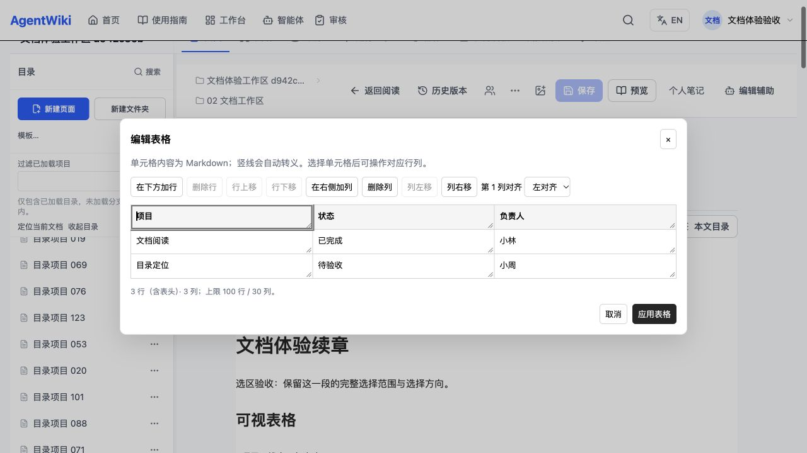
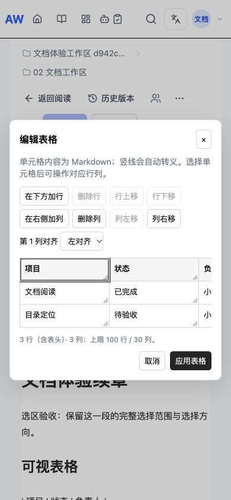

# 最终浏览器验收

结论：本轮5项通过。CUA控制真实IAB，独立本机API和生产Vite构建，130页临时Space；桌面1280×720、窄屏390×844。无Save操作。

完整交互修复候选18626a37；最终213a2aae只补工具栏焦点下的翻页键，重新构建并完成实际键盘导航、普通选区往返、源码一致性、CRLF与控制台检查。其余未改动交互证据保留在同一验收链中。原始观察值见[browser-final-receipt.json](browser-final-receipt.json)。

| 场景 | 实际结果 |
| --- | --- |
| 完整选区 | 正向0→23、反向23→0恢复相同文字和方向；确认预览0个CM、返回1个CM。 |
| 主动导航 | 大纲跳转长文区返回该标题折叠光标；最终按钮保持焦点时End使scroll608→2979.5，返回新视口段落47，不恢复旧选区。 |
| 目录 | 从相邻页面把树滚至5157，Back后当前行自动可见（y355..395，port355..720）；同页手动2338经reload仍2338。 |
| 底部菜单 | 向上打开，全部操作y565..665在720视口内；手动定位仍正常。 |
| 面板 | 大纲290宽及open经真实reload保留，close跨文档保留；协作notes/330，移动临时关闭后桌面恢复。专用关闭按钮可点击。 |
| 链接 | real recent100无远古星河，服务端搜索命中更旧目标；原位置插入WikiLink并一次undo完全恢复。 |
| 表格 | 单cell仅替换小林→小陈；行移位/新增行列/对齐/列移位只改目标表格，前后与第二表逐字保留；一次undo完全恢复。 |
| 窄屏表格 | 入口中心hit真实button、click打开dialog；内部滚动，页面宽度390；无修改应用/草稿Escape保持Save禁用，Escape回CM焦点；mobile cell edit+undo精确保真。 |
| CRLF | 显示换行保真回退，grid不打开、Save禁用；最终API原文及updatedAt不变。 |
| 控制台/持久化 | 浏览器error/warn为空；最终UI全文等于基线；API两页title/content/updatedAt完全未变。 |

打开和无修改应用不会创造修改；表格编辑是本地草稿，正式保存仍是独立动作。现有编辑器在修改后精确undo仍显示dirty，测试离开时明确确认，不保存；最终fresh editor原文比对且Save禁用。这不被记录为服务端更改。

临时账户已通过UI退出，创建的tab已关闭，viewport override已reset。见[runtime/no-save-receipt.json](runtime/no-save-receipt.json)和[runtime/cleanup-receipt.json](runtime/cleanup-receipt.json)。原生IME/Windows/外部provider/真实多人压力不在本轮验收范围。
