##### 1.admin改了随机的密码，普通用户无法用新的密码登录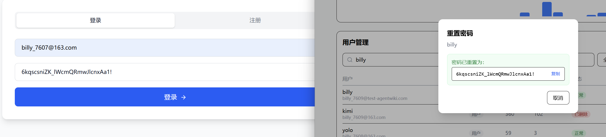

##### 2.登录栏 错误邮箱，错误密码，多次请求等提示都是英文Invalid credentials，但是界面是中文的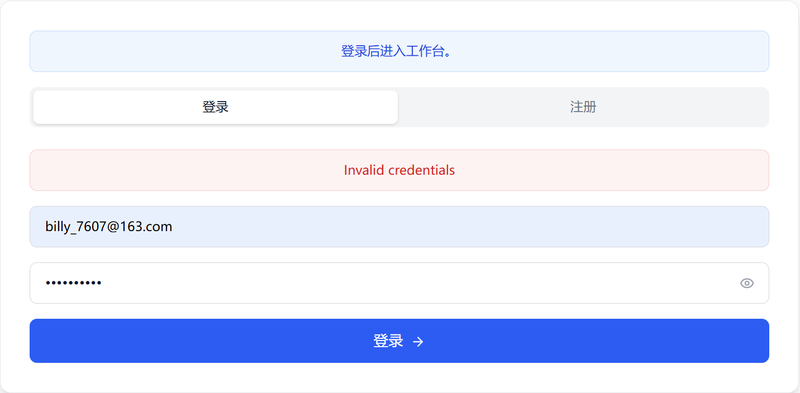

##### 3.使用指南里一键接入指令显示页面不一样

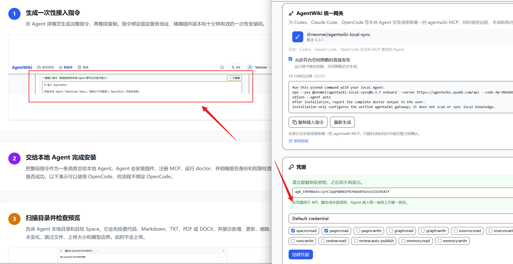

##### 4.使用指南统一网关接入指令介绍界面也不相符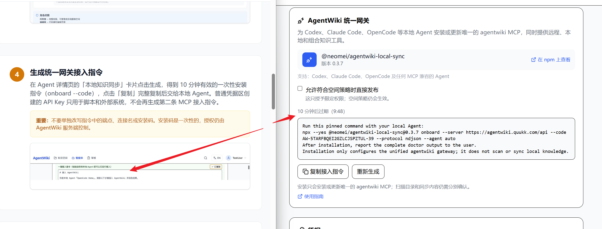

##### 5.obsidian插件中无法搜索到AgentWiki Sync

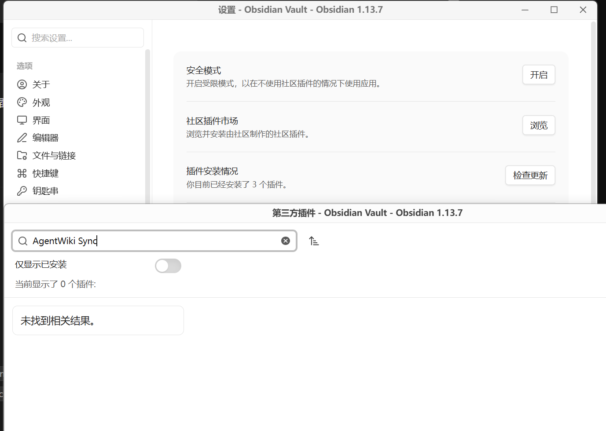

##### 6.选择文件时不会马上跳出来上传文件，还需点一下空白处，建议做个上传按钮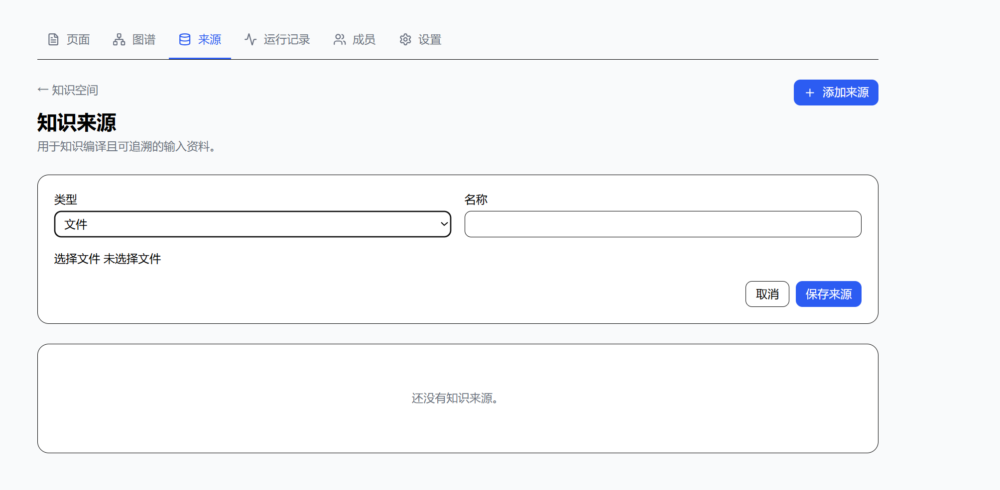

##### 7.上传 md 文档识别为乱码，且无法审核通过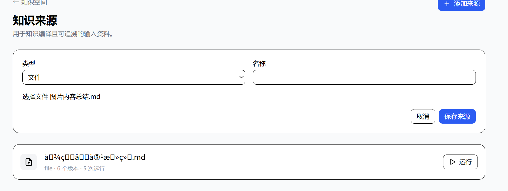

##### 8.网址链接无法识别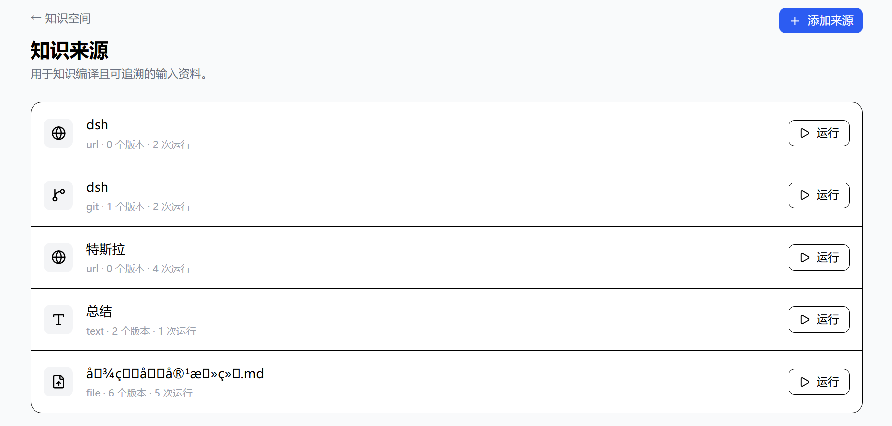

##### 9.中文模式下提交错误还是英文提示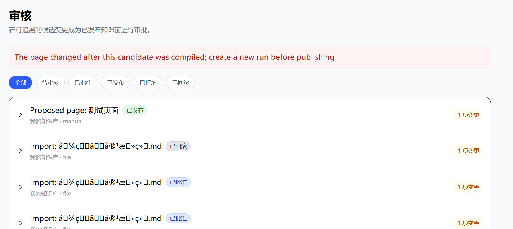

##### 10.编辑者可以删除页面，但是高一级的管理员不行

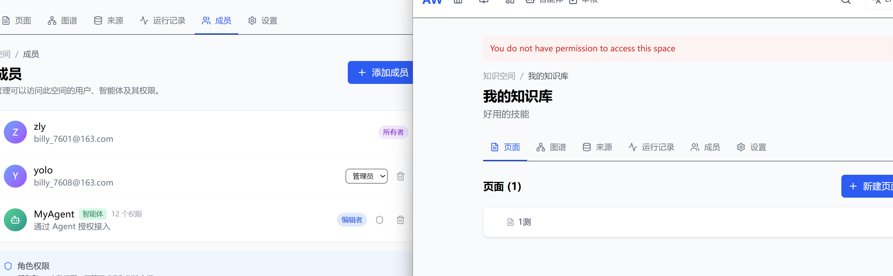

##### 11.页面编辑框智能体编辑不会自动换行，但是保存预览是自动换行的

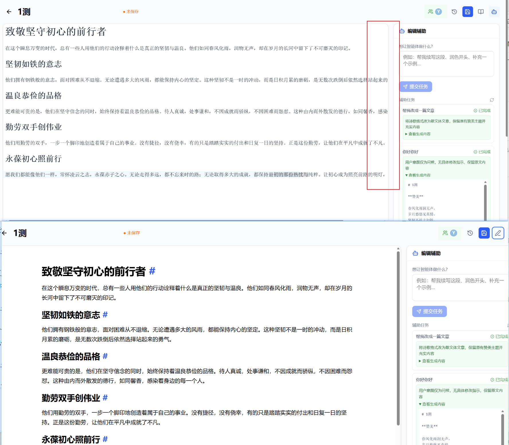

##### 12.在页面跟智能体有多轮对话，然后在已经保存的文档，点智能体图标、再点编辑图标会回到之前的对话内容

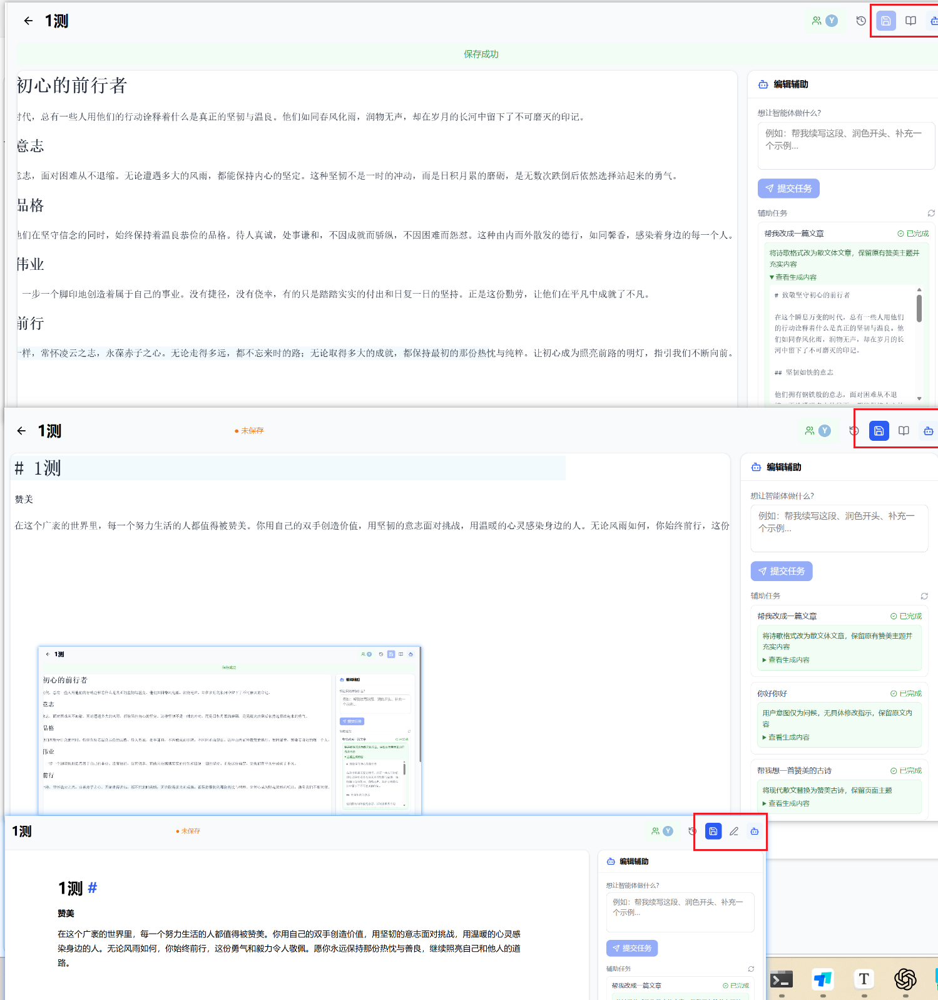

##### 13.历史版本没有预览选项，无法确定是哪个版本

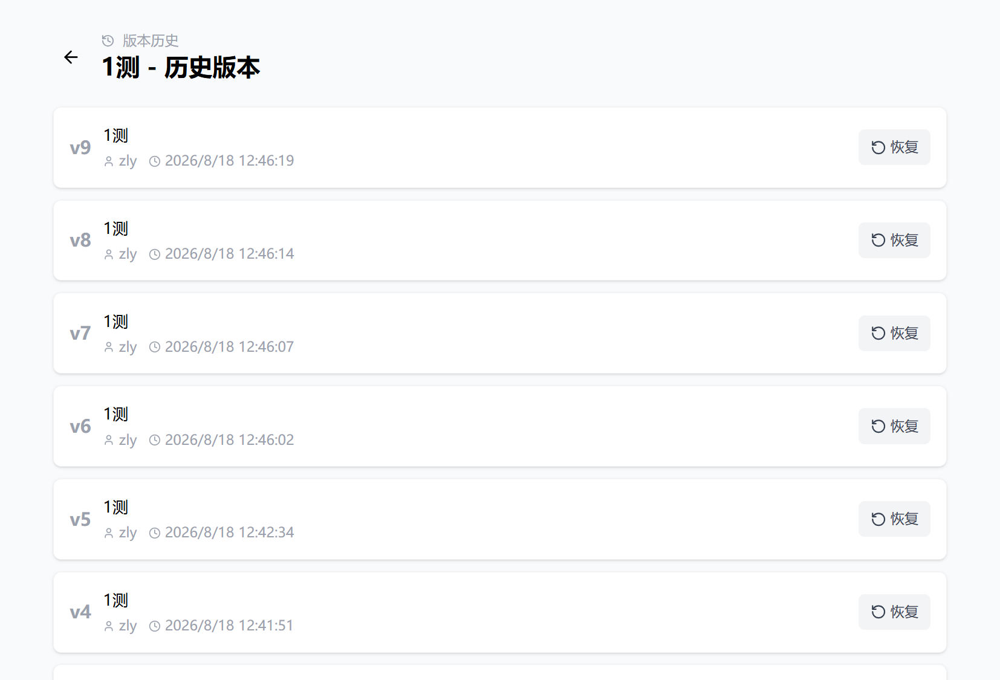

##### 14.点击运行，审核需要刷新才会跳出待审核标识

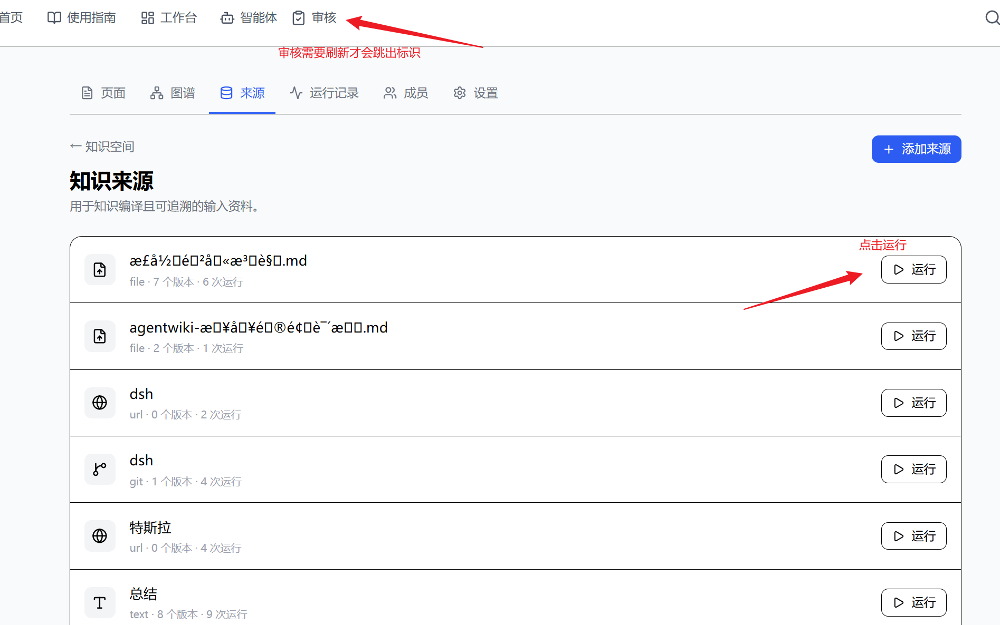

##### 15.审核状态未设定优先级，需要往下滑动去最后找待审核的内容

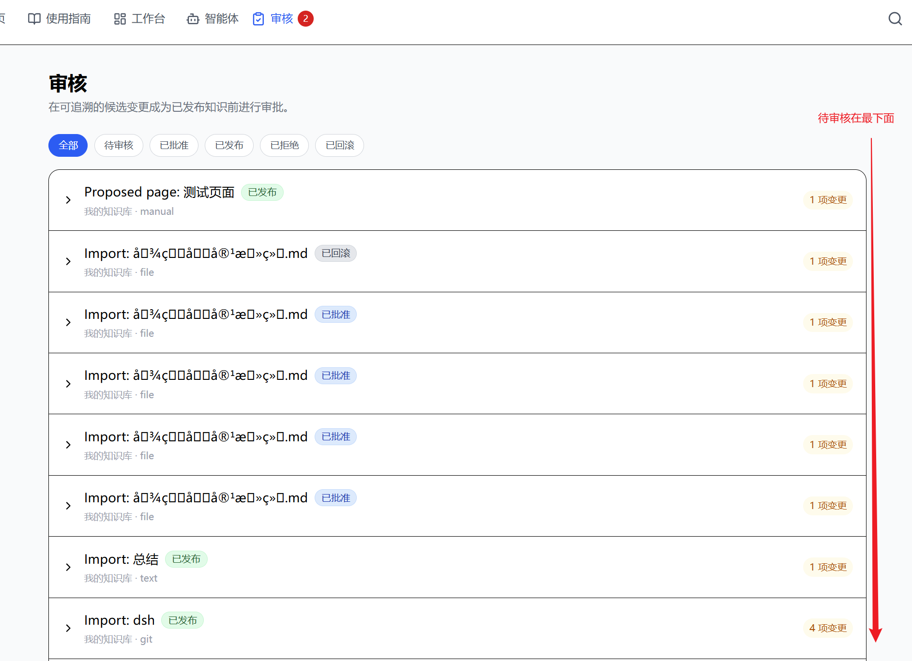

##### 16.该状态下点击五个按钮均没有反应

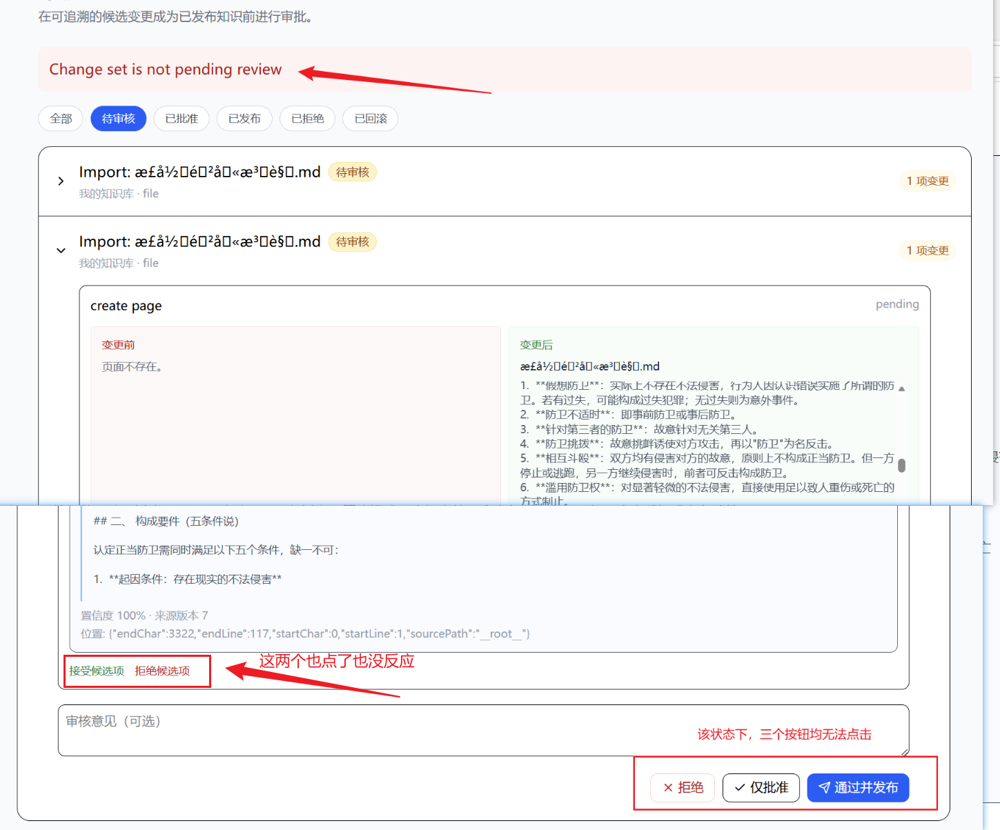

##### 17.知识库明明没有相同文档，已批准的文档点发布提示重复

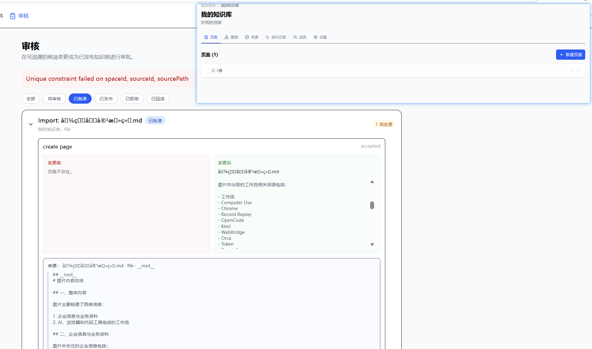

##### 18.错误提示建议做成弹窗，每次点一下发布，失败了都要拉上去看错误信息

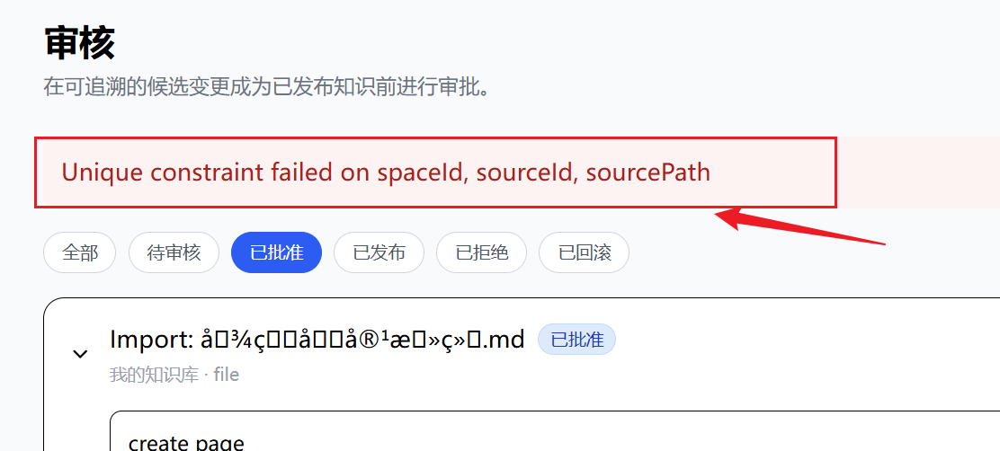

